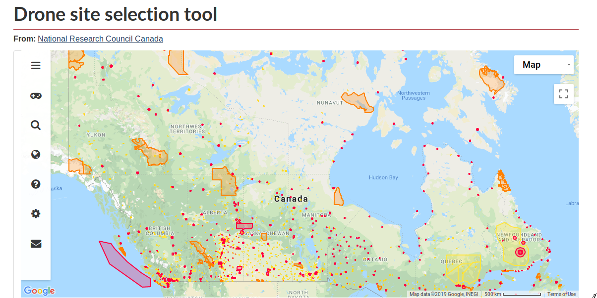

Canada has passed new reglations on June 1st 2019 which requires drone operators for drones above the toy limit of 250 grams to have one of two drone operator licenses. Drones must be registered and pilots must carry a valid license when operating a drone.

Canada is very close to [Denmark][denmark drone laws] in its drone legislation, since you need to take an online exam for the basic certificate and an in person test, like for a drivers license, for advanced usage.

Fines for non-complines range from 1000 to 15000 Canadian Dollars.

## Is a permit required to fly a drone in Canada?

If your intention or shots meet **any** of the following conditions, you will need a drone license in Canada:

- Your drone weighs over 250 grams (almost every camera drone)
- You want to fly it closer than 30 meters to people or over people in any distance
- You want to fly in controlled air spaces

## Where can I fly my Drone in Canada?

The National Research Council has prepared [an interactive map](https://nrc.canada.ca/en/drone-tool/) where you can check controlled air spaces and zones where you need a permit.

The yellow zones require caution, the red zones require a dedicated permission for your planned flights.

## How do I apply for a drone permit?

For the [certificate, just use the government form](https://www.tc.gc.ca/en/services/aviation/drone-safety/get-drone-pilot-certificate.html).

Remember to [register your drone](https://www.tc.gc.ca/en/services/aviation/drone-safety/register-drone.html).

If you are a visitor to Canada, you need to have an equivalent certificate of competency for the purpose of your flight in Canada.

If you need to fly within a restricted zone, you can conctact the authorities at this email address in good time: [TC.RPASCentre-CentreSATP.TC@tc.gc.ca](mailto:TC.RPASCentre-CentreSATP.TC@tc.gc.ca)

## Sources

- [Canadian Government site about drone safety][tc drone safety]

[tc drone safety]: https://www.tc.gc.ca/en/services/aviation/drone-safety/flying-drone-safely-legally.html
[denmark drone laws]: https://law.photography/law/drone-photography-laws-in-denmark
