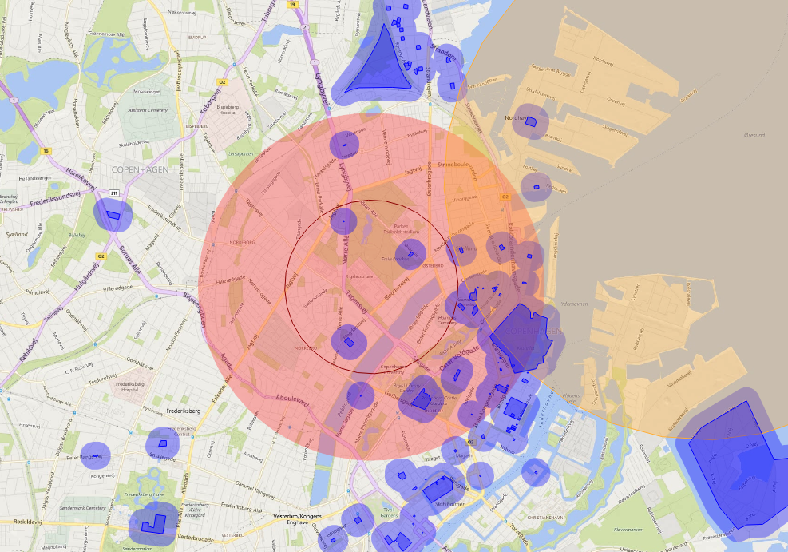

Hobbyist and professional drone operators are different in the eyes of the law in Denmark. Both need a permit, but the amateur drone permit is basically a self-service test you can take online.

## Is a permit required to fly a drone in Denmark?

Yes, at least if your drone weighs more than 250g. If you have an adress and can authenticate yourself with NemID in Denmark you can take the amateur / noncommercial license here: [dronetegn.dk][]

If you want to fly within densely populated areas or closer to airports, you'll need the next level of permit, which actually requires training and is more like a drivers license, a _dronebevis_.

## Where can I fly my Drone in Denmark?

There is an interactive map available that shows you which areas are restricted for a number of reasons, for example close to an airport or near a high security building, [droneluftrum.dk][].

Short legend for the map:

- red: no fly zone
- green: only required for official business concerning the nature reservation
- yellow: currently active no fly zone (might vary)
- blue: seek permission by the juristiction it's in

## How do I apply for a drone permit?

If you are not living in Denmark or if you want to fly inside a restricted zone for a commercial production, you can write [info@tbst.dk](mailto:info@tbst.dk) an email, remember to include the following:

- name and a drone license or certificate copy (If you have the danish dronebevis, the registration number will do)
- map, address and coordinates of your planned flight
- reason for your flight
- which time frames you would like to be flying

Answers can take several weeks, so make sure to contact them in due time.

[dronetegn.dk]: http://dronetegn.dk/
[droneluftrum.dk]: https://www.droneluftrum.dk/
[trafikstyrelsen.dk/da/droneregler]: http://www.trafikstyrelsen.dk/da/droneregler
