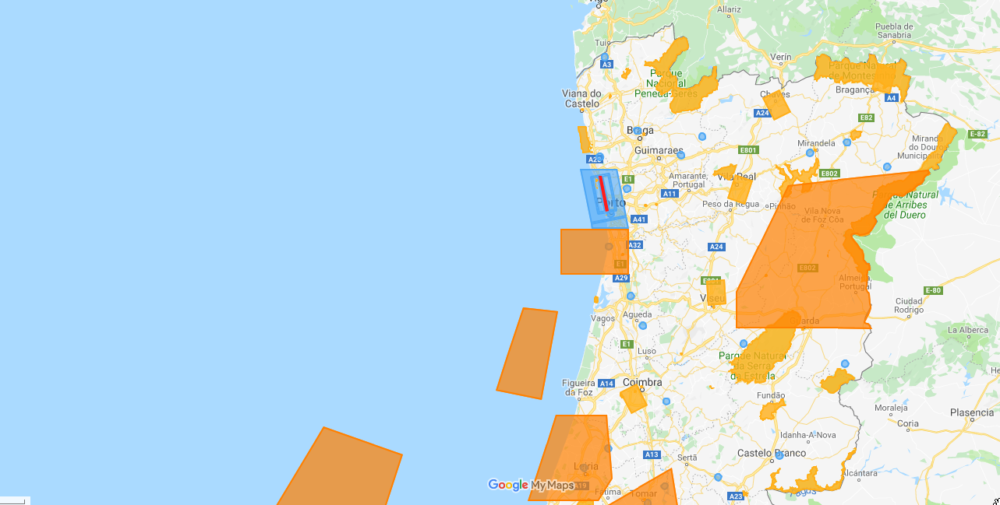

There is a distinction between commercial and hobbyist drone operators in Portugal, which sets them apart a little when it comes to the rules.

There also are two different agencies in Portugal regulating drone flight, which is the [AAN][aan] and the [ANAC][anac], the most recent regulation is _No.1093/2016_ which took effect in January 2017.

Some of the rules are relatively restrictive regarding maximum height of a flight and the line of sight to the drone by the pilot.

## Is a permit required to fly a drone in Portugal?

You don't need a license or statement of competence.

For _recreational_ use, no permit is required, please see the next section for exceptions.

You'll need a permit if you want to fly a drone that weighs more than 25kg or if you want to exceed 120 meters of height.

You generally do not need permission to fly your drone otherwise. If your drone exceeds weight or height limits, you will fly at night, you'll need a permit from the [AAN][aan].

## Where can I fly my Drone in Portugal?

Some zones in portugal are restricted for drone flying, like the following:

- national parks
- military air spaces / no fly zones
- close to airports
- miscellaneous no fly zones or where rescue operations are in process

There is also a rule about not flying your drone near crowds, probably motivated due to privacy concerns, where a crowd is defined as more than 12 people. When flying at events where you are at the inviation of the host or at a wedding for example, this probably does not apply.

There is a map of the no fly zones at [voanaboa.pt][voanaboa map], which lays out most of the no-fly zones currently in effect.

There's also a download available, if you want to view the zones in Google Earth, locally on your computer.

## How do I apply for a drone permit?

If you want to fly in a national park, there's a [form available][nature form] that can be sent to [rtn@icnf.pt](mailto:rtn@icnf.pt)

If you're planning flights over historical sites, you might have to contact the local authorities as well.

[voanaboa map]: https://www.voanaboa.pt/codigo-drone/
[nature form]: https://www.voanaboa.pt/Files/downloads/Formulario_utilizacao_drones_ICNF.pdf
[aan]: https://www.aan.pt/
[anac]: https://www.anac.pt
