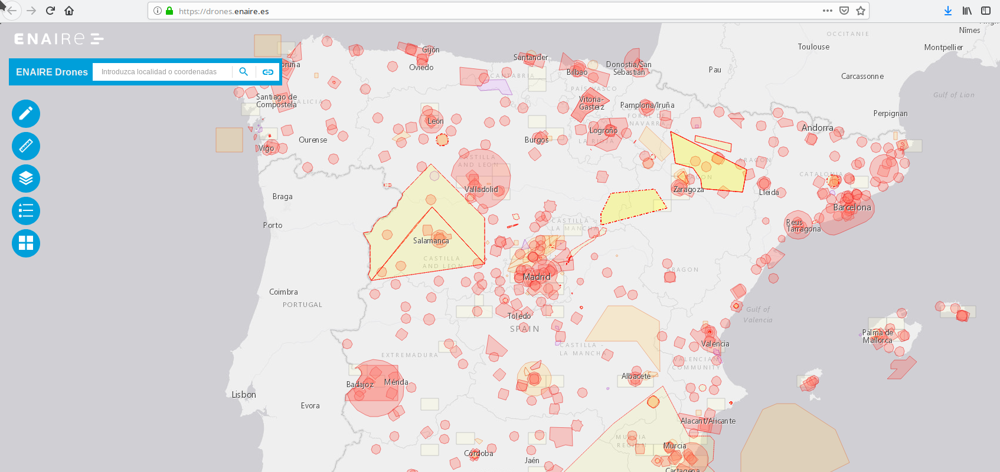
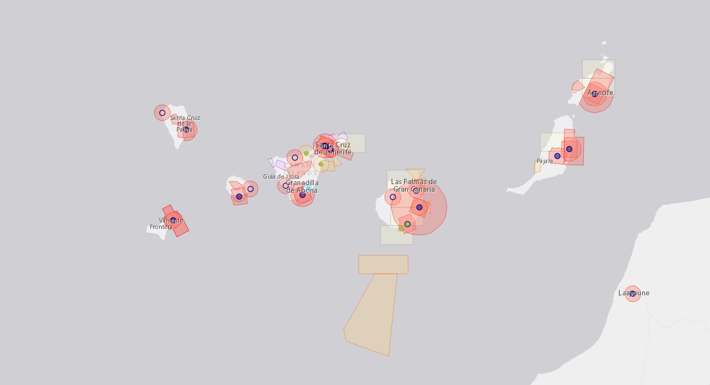

There is a distinction between commercial and hobbyist drone operators in Spain, which sets them apart a little when it comes to the rules.

If you aim to fly your drone commercially, you will need to invest in being certified and taking a course at one of the many drone schools throughout Spain or having your license from another country recognised.

## Is a permit required to fly a drone in Spain?

No, you don't need a permit or a license unless you are flying for a commercial project or your maximum takeoff weight exceeds 2kg.

However, you also need to follow rules such as:

* Don't fly your drone in first person view (FPV) without somebody keeping line of sight to the drone
* Don't fly your drone further than 500 meters away
* Don't fly your drone higher than 120 meters from the ground
* Don't fly your drone above people
* Don't fly your drone at night
* Don't fly your drone closer than 150m to buildings
* Don't fly your drone closer than 50m to people

## Where can I fly my Drone in Spain?

Some zones in Spain are restricted for drone flying, like the following:

- national parks (without approval from the AESA)
- military air spaces / no fly zones
- close to airports (10 to 15km radius around them)
- miscellaneous no fly zones or where rescue operations are in process

The government provides [an interactive map by ENAIRE.es](https://drones.enaire.es/) that shows no fly zones very precisely and illustrates the reason for the no fly zone as well.

In Spain the local governments can overrule parts of the regulation with either stricter or more lenient legislation.

Some areas are technically fine to fly a drone in, but photography from it may be prohibited.

### Canary Islands

The canary islands, La Gomera, Tenerife, Lanzarote and Gran Canaria are covered in the drone map above as well, obviously airport no fly zones and national parts restrict parts of the islands.

## How do I apply for a drone permit?

If you want to fly in a zone that may be a restricted zone because it is a national park, or if you're uncertain about a regulation, you can reach out to [drones.aesa@seguridadaerea.es](mailto:drones.aesa@seguridadaerea.es) via email.

## Our Experience

We flew a drone in December 2019 and other tourists in the same (legal flying) area by a cliff in Garachico seemed unbothered and nobody approached us about it.

## Sources

* [enaire.es](https://www.enaire.es/services/drones/basic_rules_for_flying_drones)
* [seguridadaerea.gob.es (ES)](https://www.seguridadaerea.gob.es/lang_castellano/cias_empresas/trabajos/rpas/faq/default.aspx#r43)
